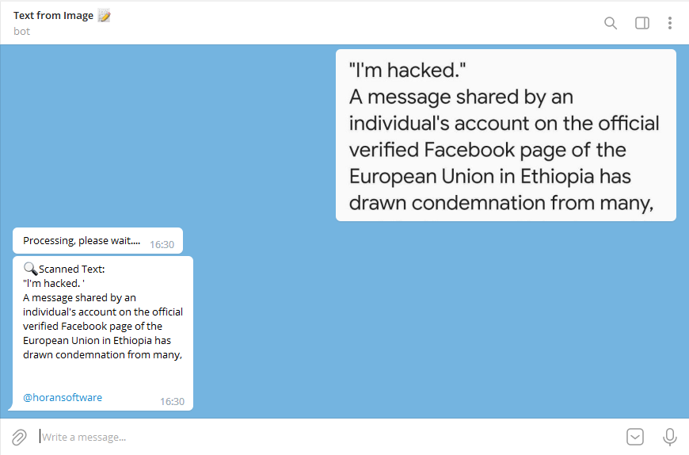

 # Text from Image Scanner Telegram Bot  &middot; 
[](https://travis-ci.org/npm/npm) [](https://www.npmjs.com/package/npm) [](http://makeapullrequest.com) [](https://github.com/your/your-project/blob/master/LICENSE)
 
Simple Telegram Bot to extract text from image based on ocr api <br>  

<a href="https://t.me.com/official_gemechis/"></a> <br />

## Check out <a href="https://t.me/horanocr_bot">The Sample Bot </a>  

<br>

## Installing / Getting started
Go to <a href="https://t.me/botfather">@botfather <a/> and create a new bot. Copy your api token and setwebhook by pasting this link on browser.
 
  &middot; Change XXXXXX with your bot token
 <br>
  &middot; Change url to domain you host the php file.

```shell
https://api.telegram.org/botXXXXXX/setWebHook?url=yourdomain.com/bot.php
```
### Code to edit

Just edit 2nd line by changing api key on bot.php
api key can be found here https://ocr.space/ocrapi
 
```shell
//Change OCR-KEY to your api key from ocr.space website
            $result = file_get_contents('http://api.ocr.space/parse/imageurl?apikey=<OCR-KEY-XXX>&url='.$id_url);
            $result=json_decode($result, true);
            $str='';
            foreach($result['ParsedResults'] as $pareValue) 
                {
                            $str.= strval($pareValue['ParsedText']);
                }
                if($str!=""){ 
                $re= 
                array(
                'chat_id' => $chatId, 
                'text' => "🔍Scanned Text:\n$str\n\n@horansoftware",
                'disable_web_page_preview' => false,);
                    send("sendMessage", $re);
                }   #end
```

## Change Bot API Token
 
Don't forget pasting your bot token every where needed in the bot.php
 
 ```shell
$path = "https://api.telegram.org/bot<Your Bot Token>/";
```
 
Code Written by 
 <a href="realgemechis.t.me">Gemechis Elias</a>
 
